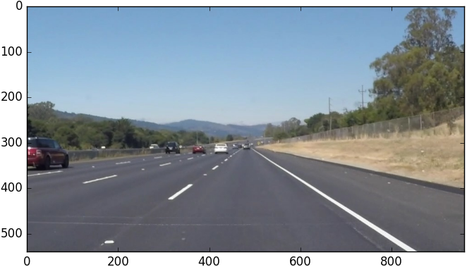
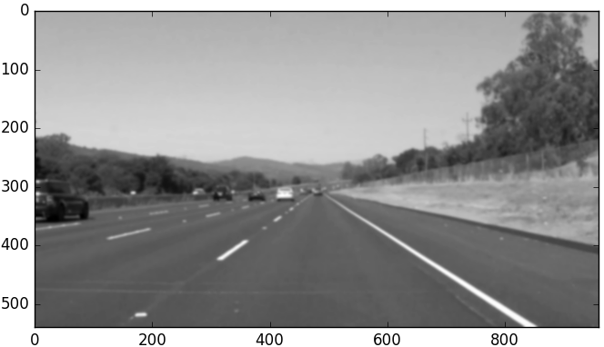
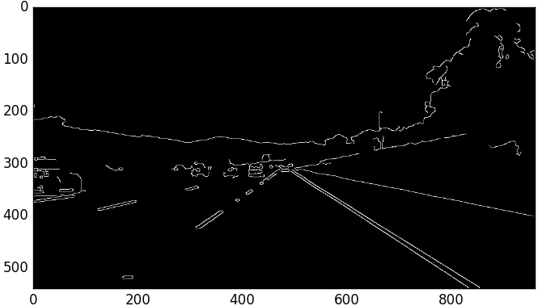
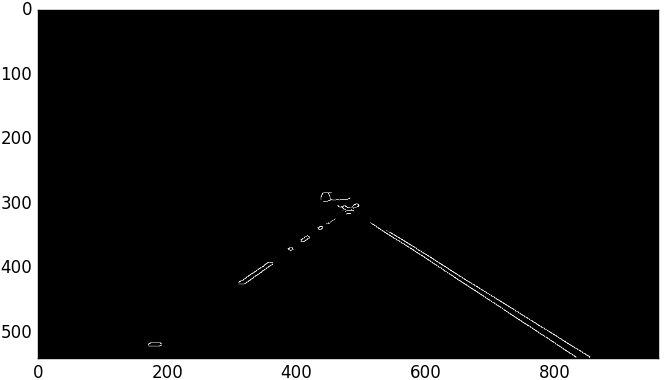
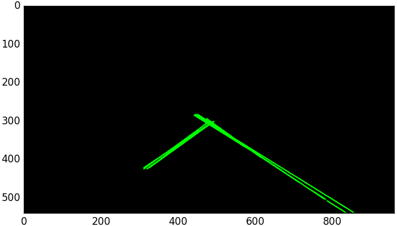
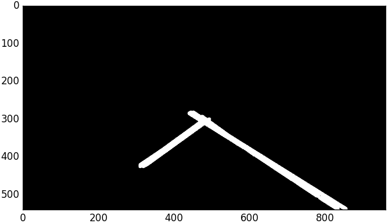
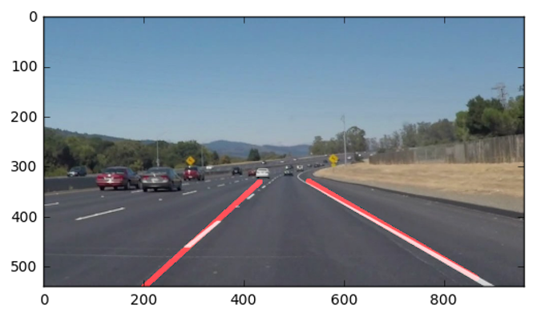

# Finding Lane Lines on the Road

#### Pipeline

1. __open image__

  

2. __convert to grayscale__

  

3. __Gaussian blur__

  

4. __Canny filter to find edges__

  

5. __Mask area of interest__

  

6. __Hough transform__

  

7. __Increase lines thickness__

  

8. __Detect blobs and fit lines to contours__

  

#### Test on videos
* [Easy](https://youtu.be/Gi0zUj4NUMM): white lines on straight road.
* [Tricky](https://youtu.be/CcpD8CPBqBs): one continuous yellow line and a dashed white line in a slightly bending road.
* [Challenging](https://youtu.be/I_LWQKc0uWc): dashed and continuous lines on a bend with shadows and color changing pavement.
