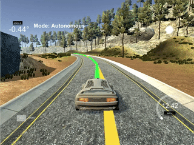

# Model Predictive Control

---

## Installation

Instructions can be found in the [original repo](https://github.com/udacity/CarND-MPC-Project).

## Implementation

### The model
The model state includes six variables: car position (`x`,`y`), orientation `psi`, velocity `v`, cross-track error `cte`, and orientation error `epsi`. 

At each iteration, the car state is given in global map coordinates. The state is converted in local coordinates by operating a roto-traslation (see [here](https://discussions.udacity.com/t/not-able-to-display-trajectory-and-reference-paths-in-the-simulator/248545/7) for details); the change of coordinates is done in `main.cpp:106`. 

Then, `cte` and `epsi` are calculated from the __polynomial fit__ted on the points (`main.cpp:119`). 

The system __latency__ of 100ms is taken into account by extrapolating the state by means of the vehicle motion model equations (`main.cpp:126`)

```
// Latency is taken into account by predicting the 
// state via the vehicle motion model.
// N.B. This is done here in car coordinates, 
// therefore y=0 always.

double latency = 100e-3; // 100ms
double lat_x = v*latency;
double lat_y = 0;
double lat_psi = -v*steer_value / Lf * latency;
double lat_v = v + throttle_value*latency;
double lat_cte = cte + v*sin(epsi)*latency;
double lat_epsi = epsi + lat_psi;
```

Actuator values are returned by `MPC::Solve` function defined in `MPC.cpp`. This function is mostly taken from [quizzes solution](https://github.com/udacity/CarND-MPC-Quizzes). 

The cost function has been tweaked to weight more `cte` and `epsi`. This was done by multiplying by 1000 the relative cost part (`MCP.cpp:59`)

The upper and lower limits of the steering angle were change to +/- 35 degrees as explained in the lecture (`MCP.cpp:183`).

The `results` vector contains the optimised actuation values and the predicted trajectory (`MCP.cpp:254`).

### N & dt
At first, `N=100` and `dt=0.1` were set so that the algorithm would predict 1000s into the future. This approach did not work because the polynomial fitting became difficult, resulting in the car being confuse and not able to stay on the road


The duration was reduced to `N=10` and the time step increased to `dt=1`. This allowed the car to be on track and to finish a lap. However, the car seemed to be very cautious in using the throttle, resulting in a hiccup motion



By further decreasing the duration to `N=1` and the time step to `dt=.1`, the car was able to predict 10 steps in the future. This is enough to drive along the track with a nice pace.

## Simulation

The car successfully complete a lap without leaving the track. The target velocity was first set to 40mph and progressively increased up to 110mph. With this target velocity, the car speeds up to 100mph before the bridge and does not leave the track in bends. For a video of few fast laps click [here](https://youtu.be/v9_pAVDo9W0).


