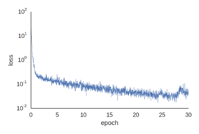
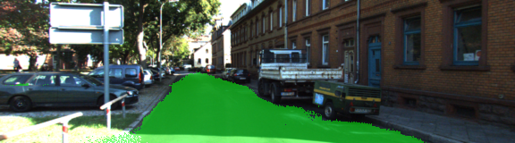

# Semantic Segmentation
### Introduction
In this project, the pixels of a road in images are labelled using a [Fully Convolutional Network (FCN)](https://arxiv.org/pdf/1505.04366.pdf).

### Setup
##### Frameworks and Packages
Make sure you have the following installed:
 - [Python 3](https://www.python.org/)
 - [TensorFlow](https://www.tensorflow.org/)
 - [NumPy](http://www.numpy.org/)
 - [SciPy](https://www.scipy.org/)

##### Dataset
Download the [Kitti Road dataset](http://www.cvlibs.net/datasets/kitti/eval_road.php) from [here](http://www.cvlibs.net/download.php?file=data_road.zip).  Extract the dataset in the `data` folder.  This will create the folder `data_road` with all the training a test images.

##### Run
Run the following command to run the project:
```bash
$ python main.py
```
### Training

The FCN was trained with the mini-batch strategy along 30 epochs. Each batch was made of 5 randomly picked images; the learning rate was set to 1e-4. The cross entropy loss decreases over time (loss time series is reported in `loss_std_out.dat`).



### Test

The network correctly classify most of the road pixels in the test dataset.


